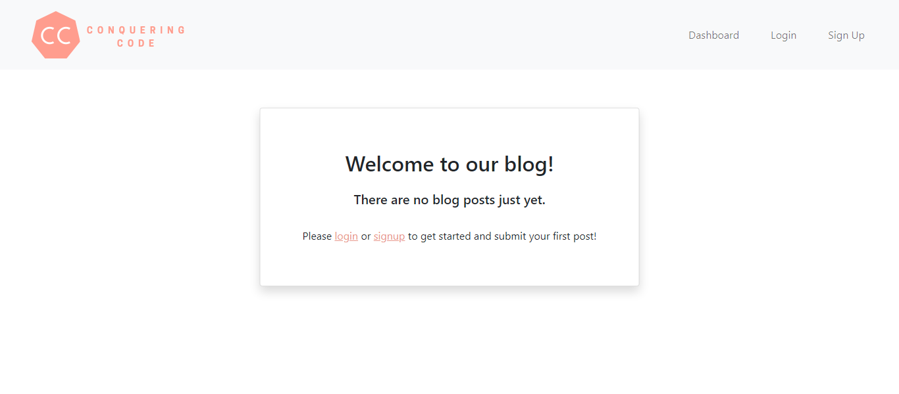
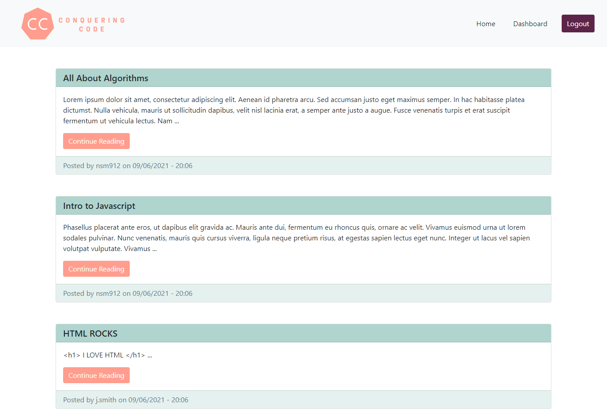
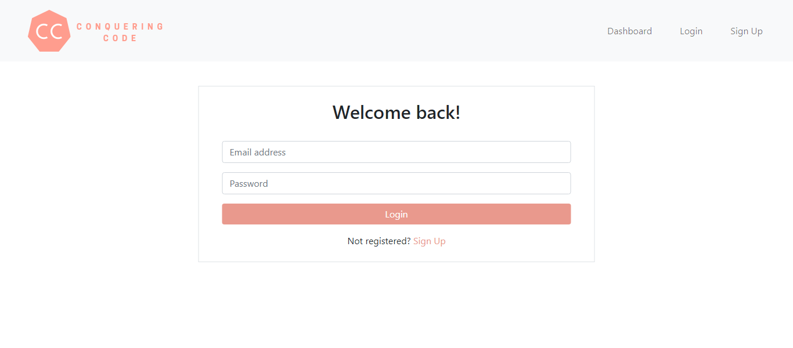
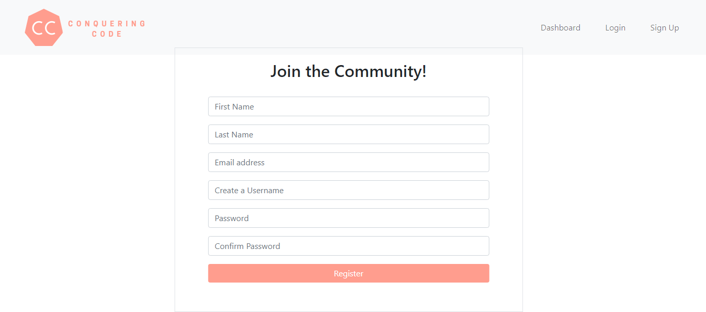
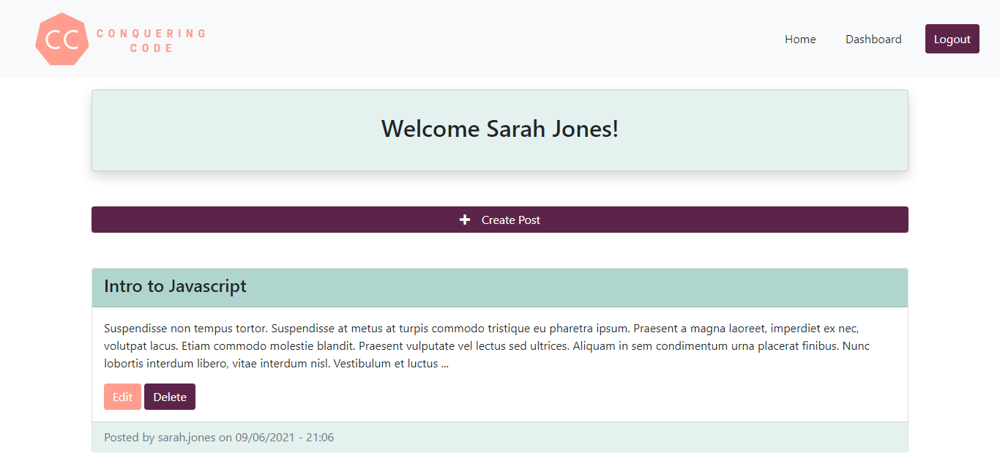
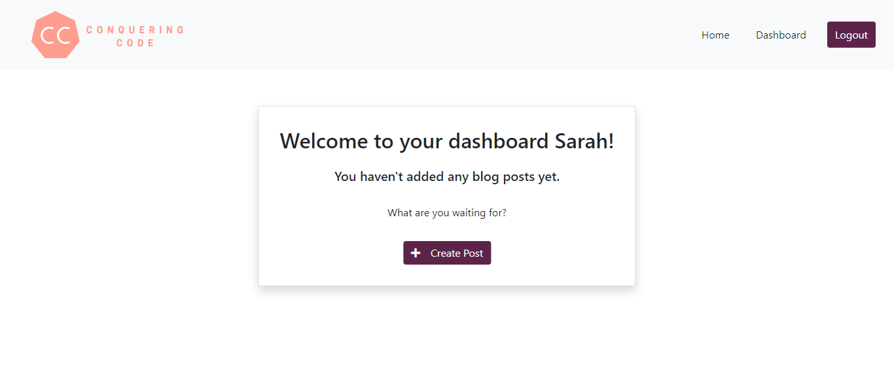

<h1>Conquering Code || Tech Blog</h1>

<h2> Table of Contents </h2>

- [Deployed App](#deployed-app)
- [About the Project](#about-the-project)
  - [Key Features](#key-features)
- [Getting Started](#getting-started)
  - [Installation](#installation)
  - [Setting up the database](#setting-up-the-database)
  - [Launch the app](#launch-the-app)
- [Questions](#questions)
- [Screenshots](#screenshots)

## Deployed App

This app is currently deployed on Heroku. Please check it out [here](https://conquering-code.herokuapp.com/).

## About the Project

This is a full stack app built with the following technologies:

- node.js
- express.js
- MySQL
- Sequelize
- handlebars.js
- JavaScript (jQuery)
- Bootstrap CSS
- HTML

### Key Features

- User authentication and sessions
- Session automatically expires after 10 minutes of inactivity
- Password hashing in the database through the bcrypt package
- Protected routes for logged in users (dashboard)
- Unauthenticated users can view all posts on home page and read individual posts but cannot interact with them (leave comments) until they are logged in.
- Authenticated users can create, edit and delete blog posts via the dashboard
- Authenticated users can view blog posts by other users on the home page and add comments
- Authenticated users can edit or delete comments they have written

## Getting Started

### Installation

```
git clone https://github.com/natasha-mann/tech-blog-mvc.git
cd tech-blog-mvc
npm i
```

You will also need to add your .env following the variables in the .env.EXAMPLE file.

### Setting up the database

In MySQL workbench:

```
DROP DATABASE IF EXISTS blog_db;

CREATE DATABASE blog_db;
```

To seed the data:

```
npm run seed
```

### Launch the app

```

npm run start

```

## Questions

If you have any questions about this application, please contact me by [email](mailto:natasha.s.mann@gmail.com).

## Screenshots







